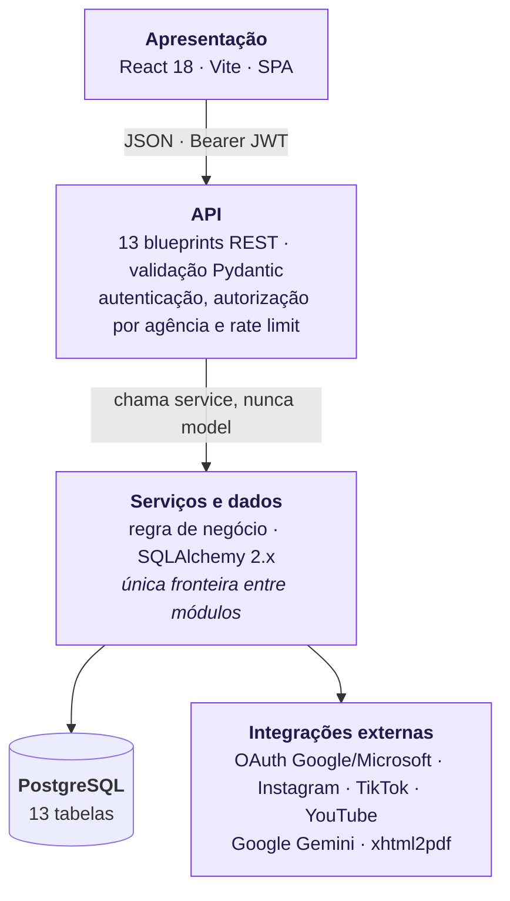
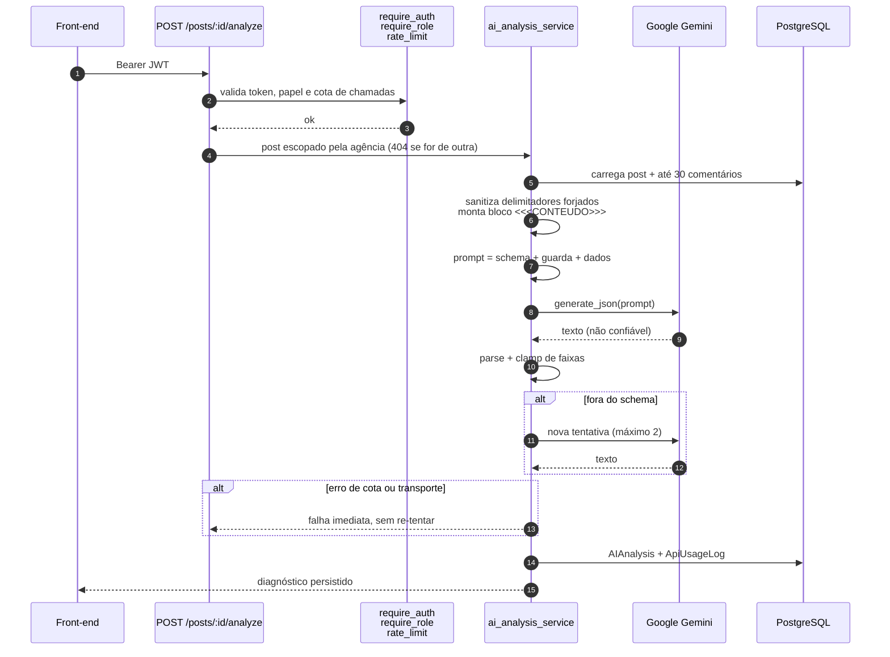
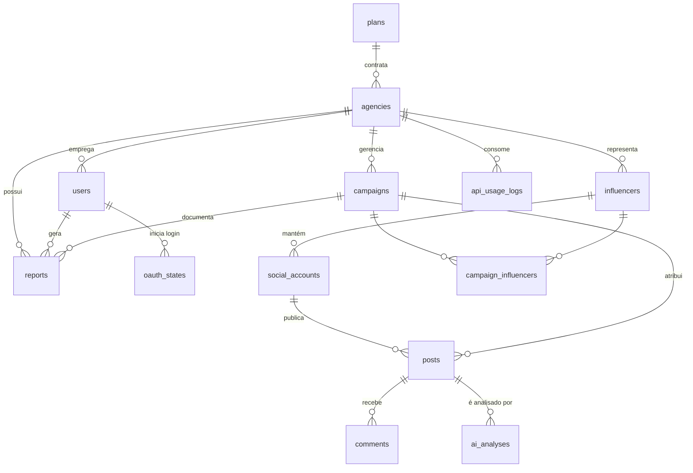
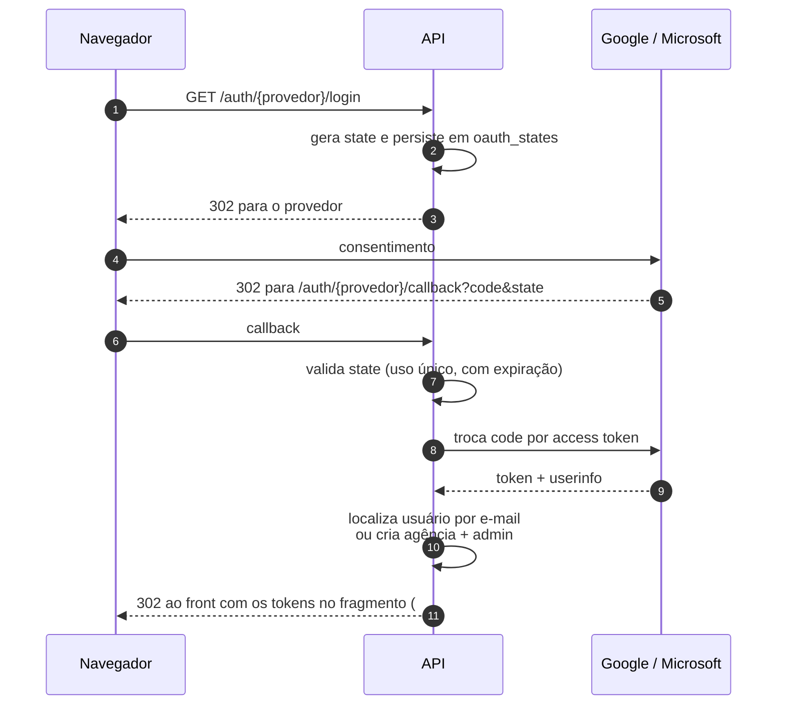

# Arquitetura — diagramas

Documentação visual do sistema, derivada do código e não da intenção: cada
diagrama foi conferido contra `src/` na data indicada. Renderizam direto no
GitHub (Mermaid).

- **Data da conferência:** 2026-08-26

---

## 1. Camadas e módulos

A decisão que caracteriza o projeto é a coexistência de duas separações. As
**camadas** são horizontais e separam por responsabilidade técnica; os
**módulos** são verticais e separam por domínio de negócio. Cada módulo
atravessa todas as camadas, com seus próprios models, schemas, services e
rotas.

A fronteira que sustenta o padrão: **módulos conversam entre si apenas pela
camada de serviços** — nunca acessando models ou tabelas de outro módulo
diretamente. Se essa regra cair, o projeto vira um monolito comum.

As camadas acima são horizontais. Cortando-as verticalmente estão os
**módulos** de negócio, cada um com seus próprios models, schemas, services e
rotas:

| Módulo | Blueprint | Service |
|---|---|---|
| Autenticação | `auth` | `auth_service` |
| Agências e usuários | `agencies` · `users` · `plans` | `agency_service` · `user_service` · `plan_service` |
| Influenciadores | `influencers` · `social-accounts` | `influencer_service` · `social_account_service` |
| Campanhas | `campaigns` | `campaign_service` |
| Coleta de métricas | `integrations` | `integration_service` · `metric_service` |
| Análise por IA | `posts` | `ai_analysis_service` · `post_service` |
| Relatórios | `reports` | `report_service` |

A regra que sustenta o padrão: **um módulo só alcança outro pela camada de
serviços**, nunca lendo model ou tabela alheia. Conferido em 26/08/2026 — nenhum
dos treze blueprints executa consulta ao banco; todos delegam. O
`dashboard_service` é o único consumido por mais de um blueprint, e é acesso
pela camada de serviço, exatamente o que a regra permite.

As colunas se correspondem verticalmente: o blueprint `posts · IA` fala com
`ai_analysis_service`, e assim por diante. Cada coluna é um **módulo**; cada
faixa horizontal é uma **camada**.

Verificado em 26/08/2026: os treze blueprints delegam a um service; nenhum
executa consulta direta. O `dashboard_service` é o único consumido por mais de
um blueprint (`campaigns`, `dashboard`, `influencers`) — e é acesso pela camada
de serviço, que é justamente o que a regra permite.

---

## 2. Fluxo de uma análise de IA

O caminho mais crítico do sistema, e o que concentra as defesas. Entrada
externa — legenda e comentários coletados de redes sociais — chega ao modelo
como **dado delimitado**, nunca como instrução, e a saída do modelo é tratada
como não confiável até passar pelo parser.

Três decisões visíveis no diagrama:

- **Re-tentativa só por falha de schema.** Erro de cota ou de rede sobe na hora:
  insistir gastaria orçamento sem chance de sucesso.
- **Clamp de faixas no parser.** Mesmo que o modelo devolva `bot_probability:
  999`, o valor persistido fica dentro do domínio.
- **Escopo por agência antes de tudo.** O post de outra agência responde 404,
  não 403 — não confirma sequer a existência do identificador.

---

## 3. Modelo de dados

Treze tabelas. A agência é a raiz de isolamento: todo dado de negócio pendura
nela direta ou indiretamente, e é isso que torna possível concentrar a
autorização num único helper (`get_scoped_or_404`).

O caminho de um post até a agência tem três saltos —
`posts → social_accounts → influencers → agencies` — e é por isso que consultas
ingênuas sobre posts viram N+1 com facilidade. Ver
[`../testes/carga.md`](../testes/carga.md).

---

## 4. Autenticação

Os tokens voltam no **fragmento** da URL, não na query: o fragmento não é
enviado ao servidor, não entra em log de acesso nem em cabeçalho `Referer`. O
front guarda o access token apenas em memória — fechar a aba encerra a sessão,
o que compensa a ausência de revogação descrita na
[ADR-001](../adr/0001-jwt-stateless-sem-revogacao.md).
